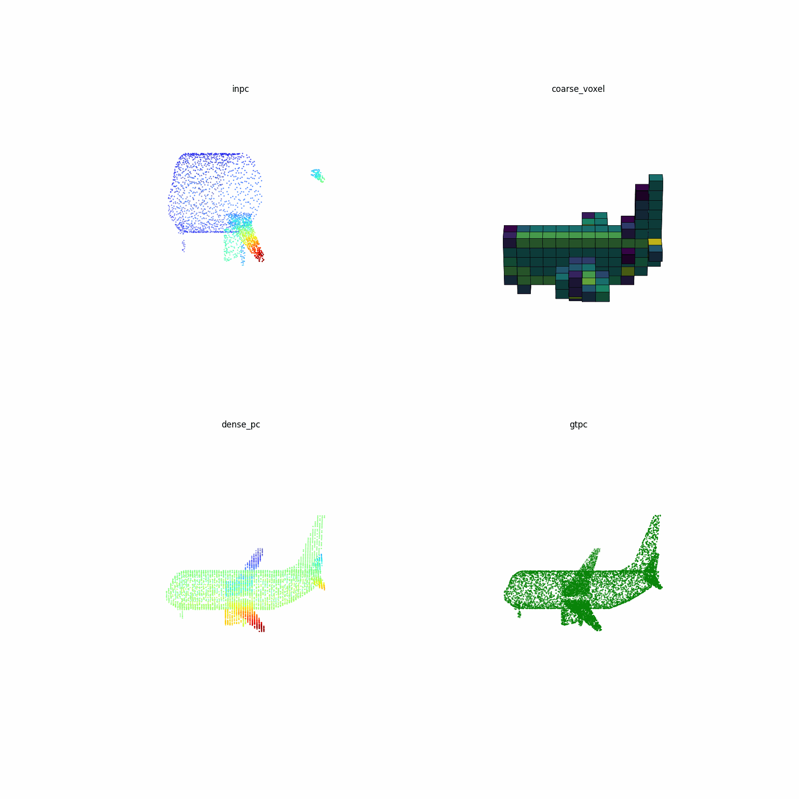

# DiFFPCC 
Occupancy Diffusion for Point Cloud Completion



# Environment

These model are implemented in PyTorch (1.13.1+cu117) version. 

The GPU is NVIDIA Tesla A100 (40GB) and the CUDA version is CUDA 11.7.

## Install
1. Requirements
```
pip install -r requirements.txt
pip install --upgrade https://github.com/unlimblue/KNN_CUDA/releases/download/0.2/KNN_CUDA-0.2-py3-none-any.whl

```
2. c++ extensions
```
bash ./extensions/install.sh
```
3. Standard PointNet++ lib 
(ref to "https://github.com/erikwijmans/Pointnet2_PyTorch")

# Usage
 

#wandb 
ps aux|grep wandb|grep -v grep | awk '{print $2}'|xargs kill -9

 
1. train from start
```
train occnet
CUDA_VISIBLE_DEVICES=0,1,2,3 WORLD_SIZE=4 python -m torch.distributed.launch --node_rank=0 --nnodes=1 --master_port=13232 --nproc_per_node=4 main.py --launcher pytorch --sync_bn --config ./cfgs/ShapeNet55_models/OccNet.yaml --exp_name try_to_train_occnet --val_freq 20 --val_interval 40  

CUDA_VISIBLE_DEVICES=0,1,2,3 WORLD_SIZE=4 python -m torch.distributed.launch --node_rank=0 --nnodes=1 --master_port=13232 --nproc_per_node=4 main.py --launcher pytorch --sync_bn --config ./cfgs/ShapeNet55_models/OccNet.yaml --exp_name try_to_train_occnet_airplane --val_freq 5 --val_interval 10   

train diffpc
CUDA_VISIBLE_DEVICES=0,1,2,3 WORLD_SIZE=4 python -m torch.distributed.launch --node_rank=0 --nnodes=1 --master_port=13232 --nproc_per_node=4 main.py --launcher pytorch --sync_bn --config ./cfgs/ShapeNet55_models/OccDiff.yaml --exp_name try_to_train_occdiff_airplane --val_freq 20 --val_interval 5

CUDA_VISIBLE_DEVICES=0,1 WORLD_SIZE=2 python -m torch.distributed.launch --node_rank=0 --nnodes=1 --master_port=13232 --nproc_per_node=2 main.py --launcher pytorch --sync_bn --config ./cfgs/ShapeNet55_models/OccDiff.yaml --exp_name try_to_train_occdiff_airplane_pretrain --val_freq 10 --val_interval 10 
 
#train finenet
CUDA_VISIBLE_DEVICES=0,1 WORLD_SIZE=2 python -m torch.distributed.launch --node_rank=0 --nnodes=1 --master_port=13232 --nproc_per_node=2 main.py --launcher pytorch --sync_bn --config ./cfgs/ShapeNet55_models/FineNet.yaml --exp_name try_to_train_finenet_airplane --val_freq 2 --val_interval 5 
```

2. resume from last break-point
```
CUDA_VISIBLE_DEVICES=0,1,2,3 WORLD_SIZE=4 python -m torch.distributed.launch --node_rank=0 --nnodes=1 --master_port=13232 --nproc_per_node=4 main.py --launcher pytorch --sync_bn --config ./cfgs/PCN_models/AnchorFormer.yaml --exp_name try_to_train_anchorformer --resume
```
3. resume from specified break-point 
```
CUDA_VISIBLE_DEVICES=0,1,2,3 WORLD_SIZE=4 python -m torch.distributed.launch --node_rank=0 --nnodes=1 --master_port=13232 --nproc_per_node=4 main.py --launcher pytorch --sync_bn --config ./cfgs/PCN_models/AnchorFormer.yaml --exp_name try_to_train_anchorformer --start_ckpts {CKPT_PATH}.pth
```
## test
```
CUDA_VISIBLE_DEVICES=${GPUS} python main.py --test ${PY_ARGS}
```
example:
```
CUDA_VISIBLE_DEVICES=0 python main.py --test --config ./cfgs/ShapeNet55_models/OccNet.yaml --exp_name test_occnet --mode easy


CUDA_VISIBLE_DEVICES=0 python main.py --test --config ./cfgs/ShapeNet55_models/DiffPC.yaml --exp_name test_diffpc --mode easy

CUDA_VISIBLE_DEVICES=0 python main.py --test --config ./cfgs/ShapeNet55_models/DiffPC.yaml --exp_name test_diffpc_airplane --mode easy

CUDA_VISIBLE_DEVICES=0 python main.py --test --config ./cfgs/ShapeNet55_models/OccDiff.yaml --exp_name test_diffpc_airplane --mode easy

CUDA_VISIBLE_DEVICES=0 python main.py --test --config ./cfgs/ShapeNet55_models/OccDiff.yaml --exp_name test_diffpc_airplane_pretrain --mode easy

CUDA_VISIBLE_DEVICES=0 python main.py --test --config ./cfgs/ShapeNet55_models/OccDiff.yaml --exp_name test_diffpc_airplane --mode median

CUDA_VISIBLE_DEVICES=0 python main.py --test --config ./cfgs/ShapeNet55_models/OccDiff.yaml --exp_name test_diffpc_airplane --mode hard


CUDA_VISIBLE_DEVICES=0 python main.py --test --config ./cfgs/ShapeNet55_models/FineNet.yaml --exp_name test_finenet_airplane --mode easy
```
 
[a trained PCN model](https://drive.google.com/file/d/19GQpm5-LRiWQl4qWR_c5gnQ8KHXOSHAe/view?usp=sharing)
